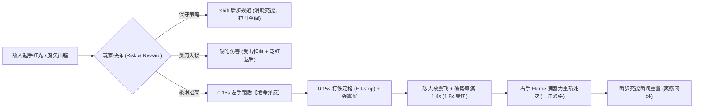
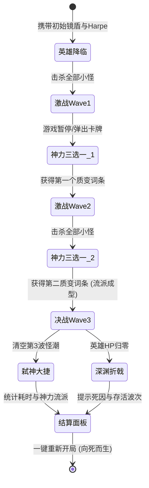

# 《HARPE》核心循环设计文档 (Core_Loop.md)

> **归属课程**：腾讯游戏学堂《AI游戏进化论》EP.04《用AI拆解功能与规划开发》  
> **核心命题**：**游戏好玩的本质是循环。从 1 秒的刀尖博弈，到 1 分钟的波次清场，再到 5 分钟的肉鸽成型，必须层层嵌套、环环相扣。**

---

## 一、 核心循环三层嵌套架构

《HARPE》的核心循环由 **微观（秒级）**、**中观（分钟级）** 与 **宏观（局级）** 三层相互嵌套组成：

```
┌────────────────────────────────────────────────────────┐
│ 宏观局级循环 (Run-to-Run: 3~5 分钟)                     │
│ 开局 ➔ 突破波次 ➔ 三选一构筑质变 ➔ 迎接胜利/重开       │
│                                                        │
│   ┌──────────────────────────────────────────────────┐ │
│   │ 中观波次循环 (Minute-to-Minute: 45~90 秒)        │ │
│   │ 波次怪潮刷新 ➔ 走位规避 ➔ 聚怪歼灭 ➔ 清场结算   │ │
│   │                                                  │ │
│   │   ┌────────────────────────────────────────────┐ │ │
│   │   │ 微观对决循环 (Second-to-Second: 0.5~2 秒)  │ │ │
│   │   │ 观察前摇 ➔ 0.15s 盾反 ➔ 顿帧瘫痪 ➔ 释放重斩│ │ │
│   │   └────────────────────────────────────────────┘ │ │
│   └──────────────────────────────────────────────────┘ │
└────────────────────────────────────────────────────────┘
```

---

## 二、 微观秒级循环：刀尖上的高风险博弈 (Second-to-Second)

这是动作游戏的灵魂。玩家的肾上腺素来自于毫秒级的风险与收益兑换：



- **博弈核心**：
  - **躲避是零收益保命**：Shift 瞬步带无敌帧，但有冷却限制；
  - **弹反是高风险终极翻盘**：时机稍早或稍晚直接硬吃伤害；但一旦时机完美（0.15s内），即可瞬间瓦解敌方攻势、获得瘫痪易伤并直接刷新位移，形成反杀闭环。

---

## 三、 中观分钟级循环：波次怪潮递进 (Minute-to-Minute)

单局由 3 个节奏分明的战斗波次组成，难度呈阶梯式上升：

| 波次 | 关卡意图 | 敌人组合 | 玩家体验目标 |
| :---: | :--- | :--- | :--- |
| **Wave 1** | **【试炼】熟悉打铁** | 2 只近战狂暴怪 | 单一维度。玩家轻松借助红光蓄力预警，练习 0.15s 镜盾弹反与重斩处决。 |
| **Wave 2** | **【阵列】双线压迫** | 1 只狂暴怪 + 2 只远程祭司 | 复合维度。既要防备近身猛扑，又要用镜盾折射漫天飞来的魔矢，考验视线切换。 |
| **Wave 3** | **【决战】构筑检验** | 2 只强化狂暴怪 + 2 只远程祭司 | 高潮时刻。怪潮形成合围，全面考验前两波挑选的肉鸽强化流派组合（如雷暴/剑气）。 |

---

## 四、 宏观局级循环：肉鸽构筑与单局生命周期 (Run-to-Run)



### 构筑驱动力（为什么玩家想再来一把？）
1. **三大极境的差异化体验**：
   - 如果第 1 波选了【神行裂隙】，玩家会化身“穿梭飞人”，用瞬步来回拉扯割草；
   - 如果选了【雅典娜的雷暴】，玩家会沉迷于“弹反打铁引发全屏金雷”的无敌反震快感；
   - 如果选了【刚体反击】，则形成“弹反 ➔ 瞬发大风车重斩”的毁灭循环。
2. **失败无挫败感，重开极速**：
   - 战败后点击重开无任何加载黑屏，1 帧重置竞技场，立刻投入下一局对决。
