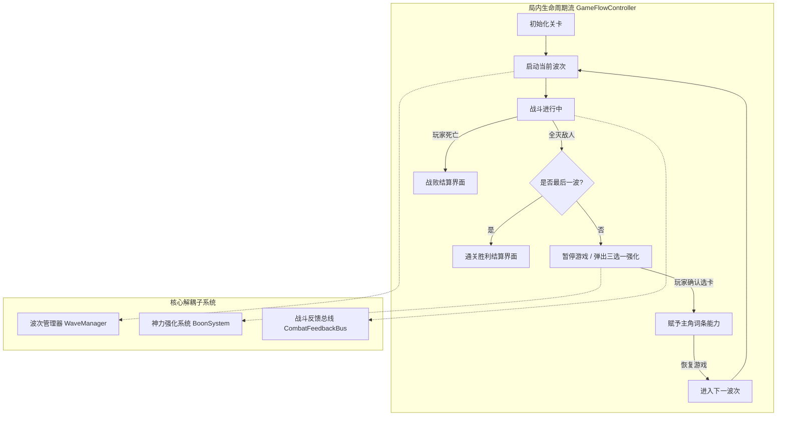

# 《HARPE》功能拆解与系统设计文档 (FEATURES.md)

> **对应课程**：腾讯游戏学堂《AI游戏进化论》EP.04《用AI拆解功能与规划开发》  
> **设计目标**：将《HARPE》从“单场战斗原型（Prototype）”推进为“具备完整局内循环的最小可行产品（MVP）”，实现模块化、解耦、数据驱动的系统工程架构。

---

## 一、 系统全景架构图 (Architecture Overview)

---

## 二、 核心功能模块详细拆解

### 模块 1：波次怪潮系统 (WaveManager)
*目标：摆脱死板的原地小怪，实现波次递进、自动统计存活、触发清场信号。*

1. **数据结构设计（WaveData）**：
   - 每波定义包含：
     - `wave_index: int` (波次编号)
     - `spawn_groups: Array` (怪群定义：敌人场景路径、刷新数量、延迟时间、位置分布)
2. **MVP 3 大梯度波次规划**：
   - **Wave 1（试炼·近战反击）**：
     - 敌人：2 只近战狂暴怪；
     - 目标：引导玩家运用 WASD 走位与左手镜盾弹反破势。
   - **Wave 2（夹击·弹幕与近战）**：
     - 敌人：1 只近战狂暴怪 + 2 只远程石化祭司；
     - 目标：考验镜面折射反弹飞弹，同时瞬步规避近战追击。
   - **Wave 3（高潮·狂暴精英合围）**：
     - 敌人：2 只强化狂暴怪（HP +50%）+ 2 只远程祭司；
     - 目标：检验前两轮所选肉鸽强化构筑的实战威力。
3. **接口与信号（API & Signals）**：
   - `signal wave_started(wave_idx: int)`
   - `signal wave_completed(wave_idx: int)`
   - `func start_next_wave() -> void`
   - `func get_remaining_enemies_count() -> int`

---

### 模块 2：肉鸽神力强化构筑系统 (BoonSystem)
*目标：实现类似《哈迪斯》三选一词条选择界面，支持数据驱动，点击即时改变角色属性与技能机制。*

1. **词条数据模型 (BoonData)**：
   每个强化词条包含字段：
   - `id: String`（唯一标识，如 `"dash_damage"`）
   - `title: String`（称号，如 `"【神行裂隙】"`）
   - `description: String`（效果，如 `"瞬步冷却减少 40%，且穿透敌人造成 35 点斩击伤害"`）
   - `category: String`（`"DASH" | "PARRY" | "HEAVY_ATTACK"`）
   - `rarity: String`（`"COMMON" | "RARE" | "EPIC"`）
   - `apply_func: Callable`（直接修改 Player 的具体逻辑）
2. **首发 6 大核心构筑词条库（覆盖三大极境）**：
   | 编号 | 词条名称 | 归属流派 | 机制效果 |
   | :--- | :--- | :--- | :--- |
   | **B-01** | **神行裂隙** | 残影瞬步流 | 瞬步冷却减少 40%，且穿透敌人造成 35 点斩击伤害 |
   | **B-02** | **金羽幻象** | 残影瞬步流 | 瞬步在原地留下一尊嘲讽石雕，吸收敌人一次攻击并自爆 |
   | **B-03** | **雅典娜的雷暴** | 绝命弹反流 | 镜盾弹反成功时引发全场金光雷震，对所有敌人造成 40 点雷暴伤害 |
   | **B-04** | **波光追踪** | 绝命弹反流 | 镜面折射的魔矢获得自动追踪弱点能力，暴击率提升至 100% |
   | **B-05** | **泰坦破军** | 破灭重斩流 | 破灭重斩蓄力时间缩短 50%，伤害提升 40% |
   | **B-06** | **刚体反击** | 跨流派质变联动 | 完美弹反不仅重置瞬步，下次蓄力重斩瞬间免蓄力瞬发 |
3. **抽取与 UI 交互逻辑**：
   - 触发时调用 `Engine.time_scale = 0.0`（或 `get_tree().paused = true`）；
   - 从词条库无放回随机抽取 3 张不重复卡牌；
   - 鼠标悬停卡牌微缩放与高亮金边；
   - 点击任一卡牌后执行能力附加，关闭 UI，恢复时间流动，开启下一波。

---

### 模块 3：局内流程与胜负控制器 (GameFlowController)
*目标：管理胜负闭环与重开机制，让游戏具有完整的单局生命周期。*

1. **胜负条件判定**：
   - **胜利（Victory）**：通过 Wave 3，消灭全部敌人。
   - **失败（Defeat）**：Player 实例发出 `player_died` 信号，当前 HP <= 0。
2. **结算 UI 界面**：
   - **战败窗口**：
     - 标语：*“神兵沉沦于石化深渊……”*
     - 统计项：存活波次、消灭怪物数；
     - 交互：【向死而生（重新开始）】按钮。
   - **通关胜利窗口**：
     - 标语：*“弑神第一步：深渊试炼初成！”*
     - 统计项：通关耗时、最终神力构筑组合；
     - 交互：【再次挑战（重开新局）】按钮。

---

### 模块 4：音画与手感总线 (CombatFeedbackBus)
*目标：统一管理顿帧、震屏与全局动效，避免代码耦合。*

- 统一调度 `trigger_hit_stop(real_seconds, scale)`；
- 统一调度 `trigger_screen_shake(intensity, duration)`；
- 预留音效挂钩点（AudioStreamPlayer 字典：`sfx_hit`, `sfx_parry`, `sfx_slash`, `sfx_win`）。
