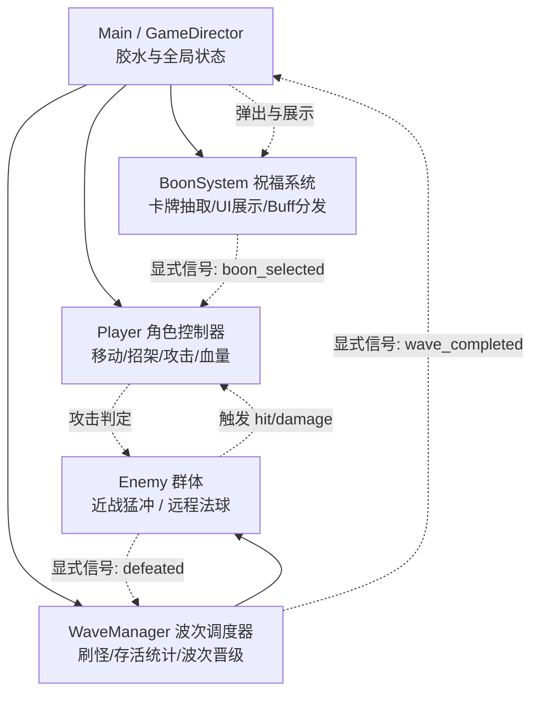

# MODULES.md —— 系统分工与依赖契约

> **定位**：明确项目核心模块的唯一职责、输入输出信号契约以及调用依赖，防止跨系统滥调用和循环依赖。

---

## 通信原则

场景树父子组件默认遵循 **Signal Up, Call Down**：父节点调用子节点方法，子节点通过信号报告状态变化。同级实体交互与全局协调按下文接口和依赖契约执行，不将父子模式机械套用到所有数据资源或跨实体调用。

## 1. 架构全景（单向依赖图）

---

## 2. 核心模块清单与契约

### 1. `Player`（玩家控制器）
- **职责**：接收键盘输入，驱动角色移动、瞬步、轻重攻击与盾牌招架，响应受击。
- **关联文件**：`res://scenes/Player.tscn`, `res://scripts/player.gd`
- **对外暴露信号**：
  - `signal health_changed(current_hp, max_hp)`
  - `signal died()`
  - `signal parry_succeeded()`
- **对外公开接口**：
  - `take_damage(amount: float)`
  - `apply_boon(boon_id: String)`
- **依赖禁区**：不得直接操作 `WaveManager` 或 `BoonSelectUI`，自身状态完全独立。

---

### 2. `Enemy`（敌人基类与变体）
- **职责**：遵循行为树/简单状态机追踪玩家，发起冲撞或远程发射法球，被击中时提供硬直与受创反馈。
- **关联文件**：`res://scripts/enemy_base.gd`, `res://scenes/EnemyMelee.tscn`, `res://scenes/EnemyRanged.tscn`
- **对外暴露信号**：
  - `signal defeated(enemy)`（**极其重要**：波次统计唯一依据，取代易崩溃的 `tree_exited`）
- **对外公开接口**：
  - `take_damage(amount: float, knockback_dir: Vector2)`
  - `stun(duration: float)`（招架成功后的硬直瘫痪）

---

### 3. `WaveManager`（波次调度器）
- **职责**：按波次难度梯度（小怪、精英词条）在竞技场边缘生成敌人，精准统计场上存活数量并推进波次。
- **关联文件**：`res://scripts/wave_manager.gd`
- **对外暴露信号**：
  - `signal wave_started(wave_index)`
  - `signal wave_completed(wave_index)`
  - `signal all_waves_completed()`
- **对外公开接口**：
  - `start_waves()`
  - `next_wave()`
- **依赖契约**：仅负责生成与监听 `Enemy`，不直接控制玩家与 UI。

---

### 4. `BoonSystem`（神明祝福系统）
- **职责**：纯数据化定义奥林匹斯神明祝福，清波时抽取 3 张不重复卡牌，暂停游戏供玩家挑选并生效。
- **关联文件**：`res://scripts/boon_data.gd`, `res://scripts/boon_select_ui.gd`, `res://scenes/BoonSelectUI.tscn`
- **对外暴露信号**：
  - `signal boon_selected(boon: Dictionary)`
- **对外公开接口**：
  - `display_selection(boons: Array)`
- **依赖契约**：数据与 UI 解耦，祝福被选中后通知 `Player.apply_boon()`，自身不持有玩家逻辑。

---

### 5. `Door`（希腊神庙石门与空间对齐组件）
- **职责**：实现希腊多立克式石柱神门。支持入场开启、出场开启、闸门重重轰落与完全封锁。提供入场步入起点与目标点坐标推导。通过 Area2D 监听英雄离室，触发转场。
- **关联文件**：`res://scenes/Door.tscn`, `res://scripts/door.gd`
- **对外暴露信号**：
  - `signal player_entered(door: Door)`
- **对外公开接口**：
  - `get_spawn_position() -> Vector2`
  - `get_entry_target_position() -> Vector2`
  - `open_as_entrance()`
  - `open_as_exit(label_text: String)`
  - `close_gate()`
  - `lock_gate()`
- **依赖契约**：仅负责门体自身状态机与触发判定，不越权控制关卡切换或玩家控制器，转场协调由 `Main` 统一调度。

---

### 6. `Main / GameDirector`（主游戏导演）
- **职责**：组装整个游戏的骨架胶水，管理 HUD、密室循环调度、随机出口生成、空间反向严格映射（上出下入、左出右入）、全屏转场过渡、通关与重开状态。
- **关联文件**：`res://scenes/Main.tscn`, `res://scripts/main.gd`
- **下行调用**：接收各模块信号，统一协调（如：开局南门入场 ➔ 敌人肃清 ➔ 三选一祝福 ➔ 随机开启 1~3 扇非入口门 ➔ 英雄穿门 ➔ 严格反向进入下一室 ➔ 终焉密室穿门大捷）。

